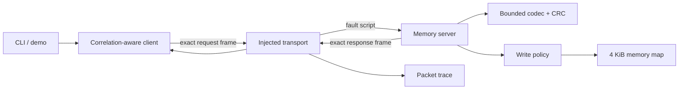

# Industrial Memory Protocol Workbench

[](https://github.com/JasonStys/industrial-memory-protocol-workbench/actions/workflows/ci.yml)
[](https://github.com/JasonStys/industrial-memory-protocol-workbench/actions/workflows/codeql.yml)

A defensive C++20 protocol lab for learning how fixed-width industrial memory interfaces should
handle framing, byte order, checksums, deadlines, correlation, access control, retries, faults, and
diagnostics.

The IMLP/1 protocol in this repository is original and synthetic. The simulator does not implement,
emulate, or claim compatibility with any commercial device or protocol, and it has no physical-I/O
or network-socket integration.

## Why this exists

A successful happy-path read says little about protocol engineering. Boundary code must reject
inconsistent lengths before indexing, convert byte order explicitly, preserve request correlation,
separate transport errors from remote errors, restrict writes below the UI, and remain explainable
when a peer times out or sends malformed bytes. This workbench makes those behaviors small enough to
inspect and rigorous enough to test.

## 60-second quickstart

Requirements: CMake 3.25+, a C++20 compiler, and Ninja or another CMake generator.

```bash
cmake -S . -B build -G Ninja -DCMAKE_BUILD_TYPE=Debug
cmake --build build --parallel
ctest --test-dir build --output-on-failure
./build/imlp-cli demo
```

On Windows with the Visual Studio generator:

```powershell
cmake -S . -B build -A x64
cmake --build build --config Release --parallel
ctest --test-dir build -C Release --output-on-failure
.\build\Release\imlp-cli.exe demo
```

## What the demo proves

`imlp-cli demo` runs five bounded simulator behaviors:

1. Reads identity bytes through a validated request/response exchange.
2. Rejects a write because the server defaults to read-only.
3. Injects a timeout and retries only the idempotent read with the same correlation ID.
4. Corrupts a response and rejects it at the CRC boundary.
5. Enables writes explicitly, writes only inside the server allowlist, and verifies the result.

The trace prints direction, sequence, outcome, and exact frame bytes. It never logs credentials
because the synthetic protocol has no authentication field.

## Major features

- Exact-frame parser with a 256-byte payload ceiling and 278-byte frame ceiling
- Explicit big-endian conversion using fixed-width unsigned integers
- IEEE CRC-32 corruption detection over header and payload
- Original 4 KiB simulator map with read-only, read/write, and denied regions
- Read-only server default plus a second, independently enforced write allowlist
- Correlation-aware client with bounded read retry and no implicit write retry
- Scripted timeout, disconnect, truncation, corruption, and wrong-ID faults
- Packet-style traces, hexadecimal inspector, and reproducible test vector generation
- 20 deterministic tests plus 22,000 generated/mutated/arbitrary property cases
- Clang AddressSanitizer/UndefinedBehaviorSanitizer and bounded libFuzzer CI campaigns
- Windows MSVC warnings-as-errors build and GitHub CodeQL security analysis
- Release benchmark with checked-in evidence and CI-generated evidence artifacts

## Architecture



See [architecture.md](docs/architecture.md) for trust boundaries and data flow, and
[protocol-spec.md](docs/protocol-spec.md) for the complete byte layout and state rules.

## Safety model

Writes require all three conditions:

- the CLI caller supplies `--allow-writes`;
- the server is constructed with `writes_enabled=true`; and
- every byte is inside both the server allowlist and the memory map's read/write region.

The lower layers do not trust the CLI to enforce safety. No command connects to a physical device.
CRC-32 detects accidental corruption; it does not authenticate a sender or protect against tampering.
See [safety-and-security.md](docs/safety-and-security.md).

## Validation snapshot

| Evidence | Result |
| --- | --- |
| Deterministic C++ tests | 20 passed |
| Generated valid frame round trips | 10,000 passed |
| Checksum mutation cases | 2,000 rejected |
| Arbitrary bounded decoder inputs | 10,000 completed without unstable accepted frames |
| MSVC configuration | C++20, `/W4 /WX /permissive-` |
| Linux configuration | Clang, warnings-as-errors, ASan, UBSan, 10,000-run fuzz smoke campaign |
| Static security analysis | GitHub CodeQL `security-extended` workflow |
| CI supply-chain policy | Every external action pinned to a full commit SHA |

Exact commands and limitations are in [testing.md](docs/testing.md); checked-in results are in
[validation-report.md](docs/reports/validation-report.md).

## CLI summary

| Command | Purpose |
| --- | --- |
| `imlp-cli inspect <hex>` | Validate and describe one exact frame. |
| `imlp-cli encode-read <address> <length>` | Produce a reproducible read test vector. |
| `imlp-cli read <address> <length>` | Read the local synthetic memory server. |
| `imlp-cli write <address> <hex> --allow-writes` | Perform an explicitly enabled, allowlisted simulated write. |
| `imlp-cli demo` | Run normal and faulted scenarios with packet traces. |

See [cli.md](docs/cli.md) for examples and exit codes.

## Repository map

| Path | Responsibility |
| --- | --- |
| `include/imlp/` | Public types, codec, memory, server, transport, and client contracts. |
| `src/` | Bounded implementations of those contracts. |
| `apps/cli_main.cpp` | Simulator CLI, inspector, trace display, and safety opt-in. |
| `apps/benchmark_main.cpp` | Five-sample encode/server/decode throughput benchmark. |
| `tests/` | Unit, integration, retry-policy, boundary, and property tests. |
| `fuzz/codec_fuzzer.cpp` | libFuzzer target for decoder and simulator boundaries. |
| `scripts/` | Bash validation plus Python repository-policy and symbol-index tooling. |
| `docs/` | Architecture, protocol, security, testing, complexity, ADRs, and reports. |
| `.github/workflows/` | Cross-platform CI and CodeQL security analysis. |

[file-reference.md](docs/file-reference.md) describes every maintained file. Source headers point to
the generated [symbol index](docs/generated/symbol-index.md) for exact declaration locations.

## Documentation

- [Architecture and trust boundaries](docs/architecture.md)
- [IMLP/1 protocol specification](docs/protocol-spec.md)
- [CLI and demonstrations](docs/cli.md)
- [Fault catalog](docs/fault-catalog.md)
- [Testing strategy and commands](docs/testing.md)
- [Safety and security model](docs/safety-and-security.md)
- [Big-O and resource bounds](docs/big-o.md)
- [Known limitations](docs/limitations.md)
- [Decision records](docs/adr/)
- [Primary sources](docs/sources.md)

## License

[MIT](LICENSE). The protocol design and sample memory map are synthetic educational artifacts.

