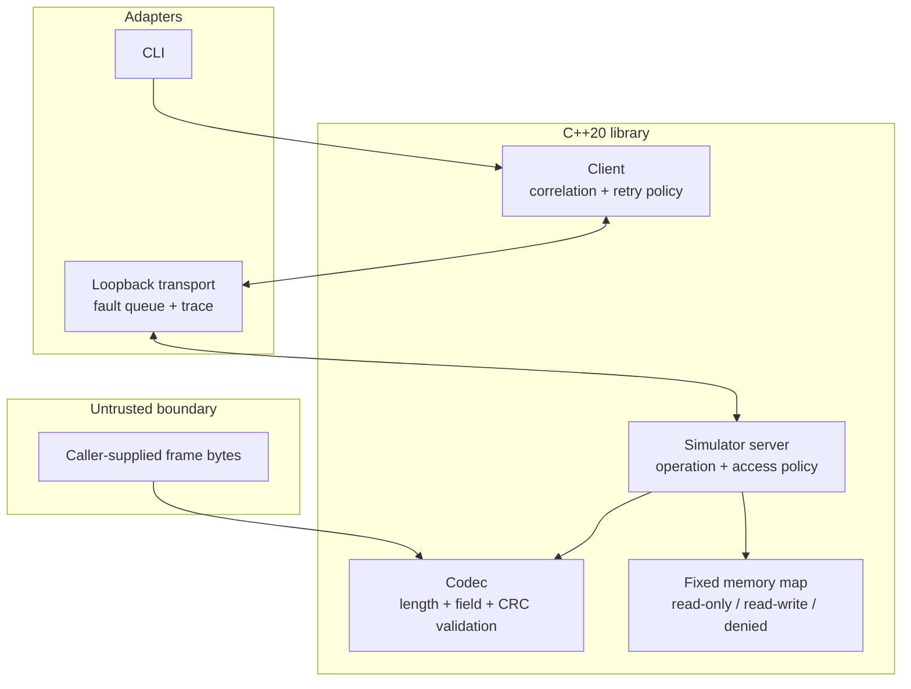
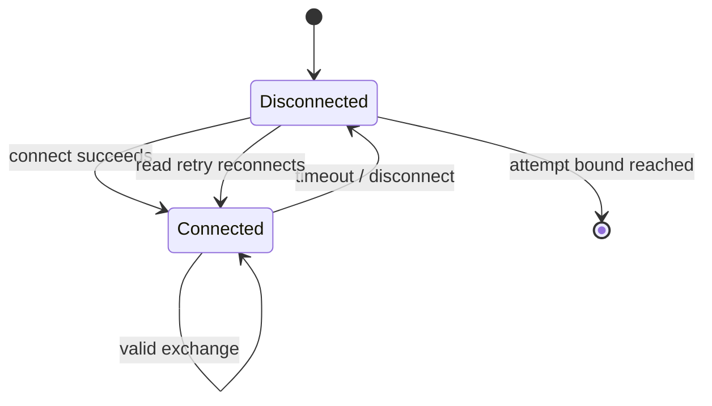

# Architecture

## Context and goals

The workbench demonstrates defensive boundary engineering for a fixed-width industrial memory
interface. It optimizes for inspectability, deterministic faults, cross-platform tests, and explicit
resource limits. It intentionally does not optimize for protocol breadth or hardware compatibility.

## Component view

## Data flow

1. The client validates operation arguments and allocates a nonzero request ID.
2. The codec verifies semantic relationships before allocating the output vector.
3. The transport records an owned request trace and optionally consumes one scripted fault.
4. The server decodes the complete frame before reading any operation payload field.
5. Read operations request a two-byte length. Write operations carry the data itself.
6. The server checks its opt-in write policy before calling the memory map.
7. The memory map validates the full range before copying any byte.
8. The response includes the original request ID and address.
9. The client rejects malformed, uncorrelated, or unexpected responses.

## Trust boundaries

| Boundary | Untrusted input | Control |
| --- | --- | --- |
| Hex CLI | text, address, length | complete `from_chars`, even-length hex, maximum frame size |
| Codec | arbitrary byte span | header-before-payload validation, exact length, maximum payload, CRC, semantic rules |
| Transport | deadline and peer result | positive deadline, explicit error category, owned trace bytes |
| Server | decoded operation | request-only opcode, read-only default, independent allowlist |
| Memory map | address plus length | subtraction-based range check and per-byte access validation |
| Client response | peer frame | CRC, request ID, address, opcode, payload length, remote status |

## State and retry model

Reads may retry transient transport failures because they are side-effect free. The same correlation
ID is reused so the trace describes one logical operation. Writes never retry implicitly: a timeout
cannot prove whether the remote write occurred.

## Resource ownership

- `MemoryMap` owns exactly 4,096 bytes.
- Decoded payloads own at most 256 bytes.
- `Client` stores only counters and the next request ID.
- `LoopbackTransport` owns queued faults and traces. Production adapters would need a trace retention
  bound; this educational adapter exposes `clear_trace()` and documents the limitation.
- RAII containers own all dynamic memory; no raw owning pointers or manual `new`/`delete` are used.

## Build and analysis boundaries

CMake defines one library and four consumers: CLI, benchmark, deterministic tests, and optional fuzz
target. Public headers are compiled by MSVC and Clang. Linux CI adds AddressSanitizer,
UndefinedBehaviorSanitizer, and libFuzzer. A separate CodeQL workflow uses a manual compiled-language
build so analyzed translation units match the project.

## Decisions

- [ADR 0001: Original synthetic protocol](adr/0001-synthetic-protocol.md)
- [ADR 0002: Explicit big-endian fields](adr/0002-explicit-endianness.md)
- [ADR 0003: Retry reads, never implicit writes](adr/0003-retry-policy.md)

